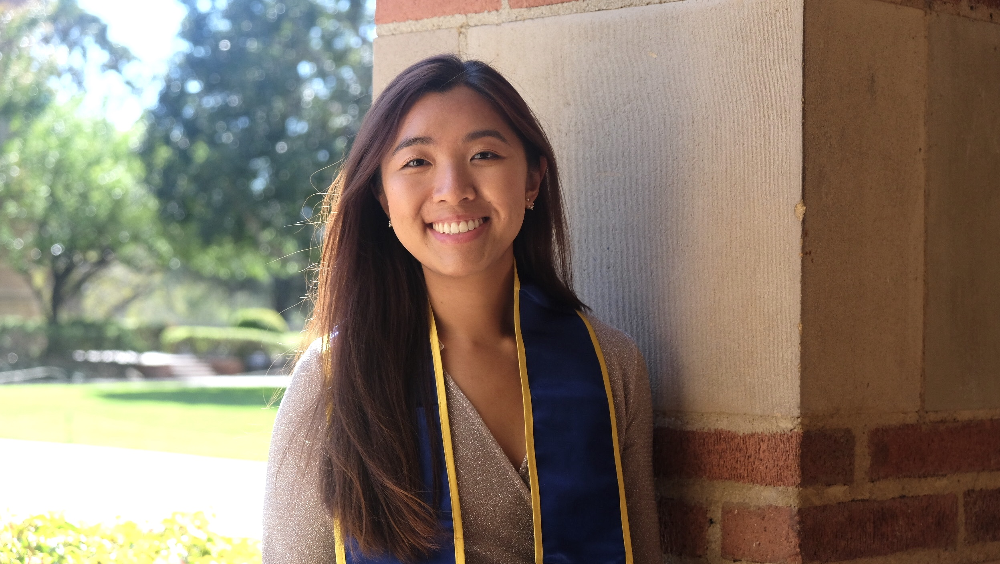
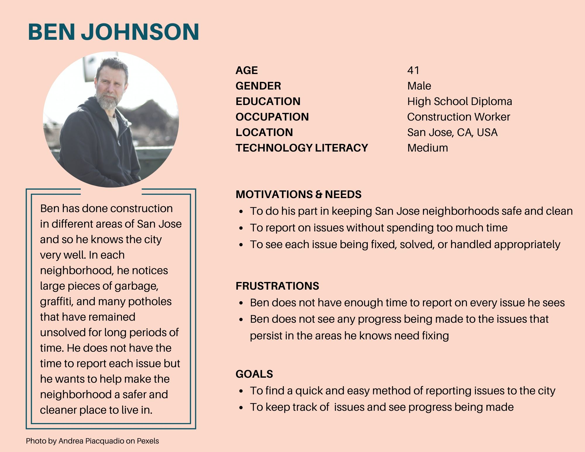
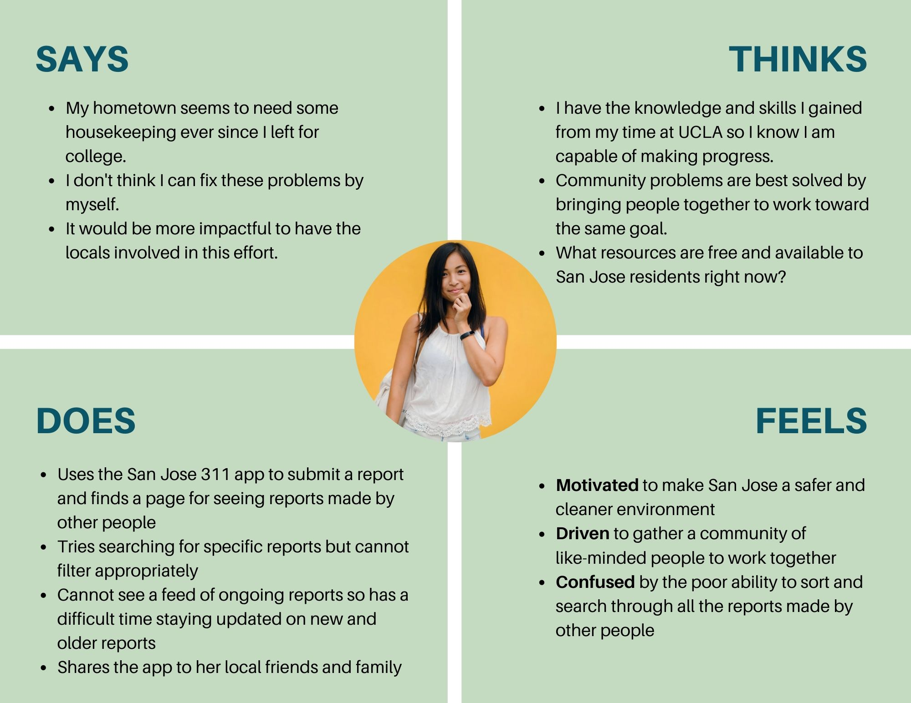
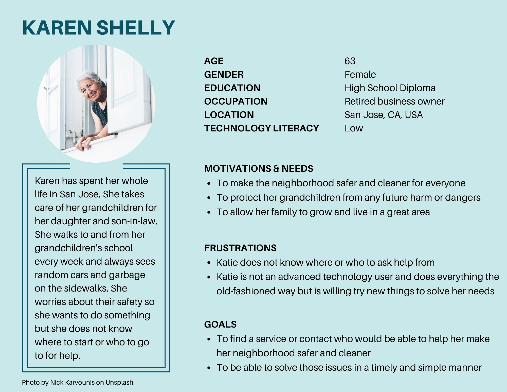
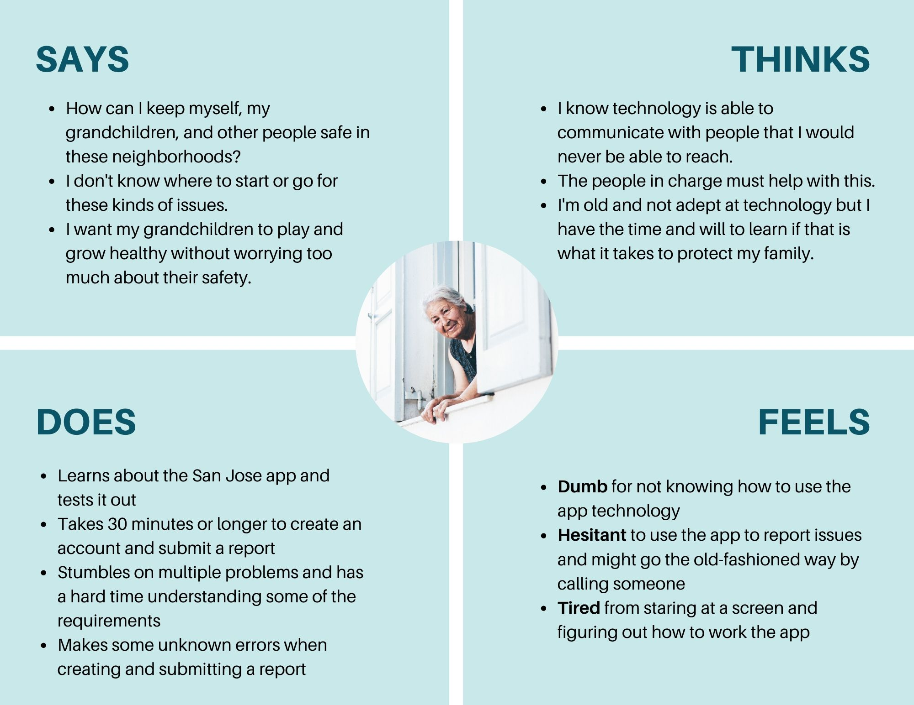
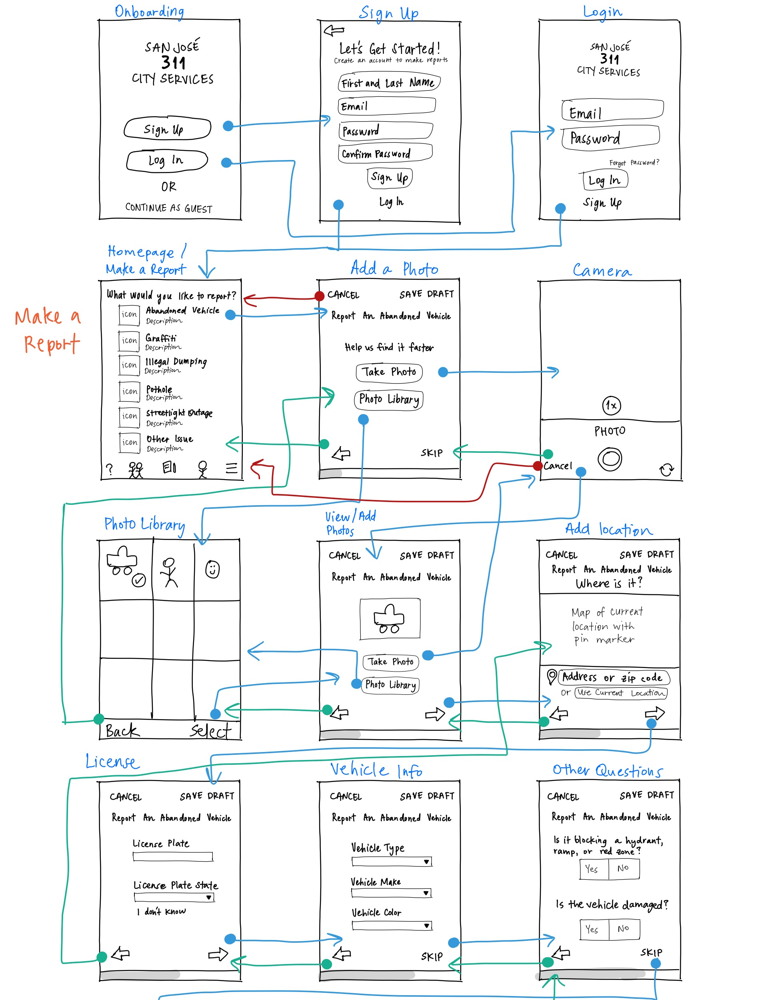
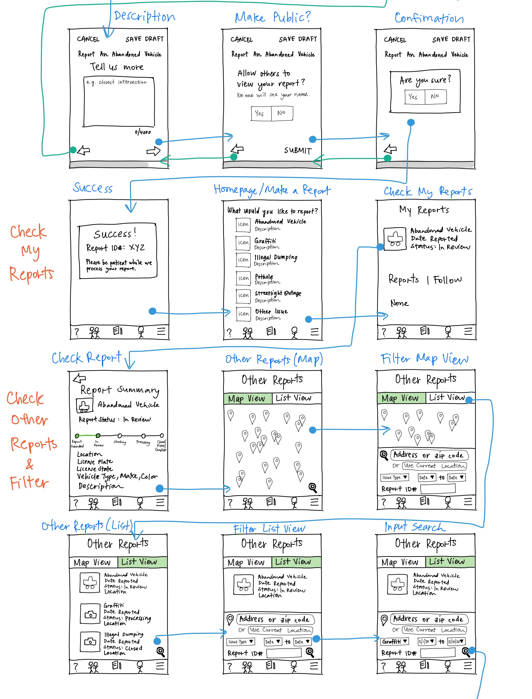
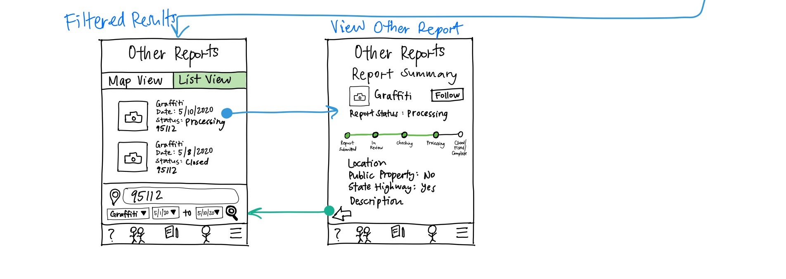

# Hello — I'm Lillian!
## Aspiring UX Researcher and Designer

I'm a recent college graduate from the University of California, Los Angeles. With a background in anthropology, I want to apply my research and qualitative analysis skills towards creating a greater impact on people. This led me to take a UX research and UX design course during my last quarter, where I've grown to love the UX field. 

It takes me from understanding why people do things to improving their experiences. That process of listening and learning to researching and designing puts people first in the center of everything — that's what makes UX so meaningful to me. 

**I'd love to speak with you!**

Say hello at lilliannguyen@g.ucla.edu or connect with me on [LinkedIn](www.linkedin.com/in/lilliannguyen97)!
Here is my [resume](LillianNguyen_Resume.pdf)!

## UX Projects
* **UX Research** — Communication During a Telehealth Experience 
* **UX Design** — San José 311 App Redesign

## Communication During a Telehealth Experience at UCLA Counseling and Psychological Services (CAPS)

### Overview
In response to the coronavirus disease (COVID-19) pandemic and shelter-in-place orders, UCLA’s CAPS transitioned to only telehealth services in order to provide remote treatment to the general student body. The transition to telehealth is new to many of the students and clinicians, and so student feedback is limited and unknown. There is a lack of information on the telehealth experience of UCLA students, or college students in general, especially in the context of this new reality. 

I determined there needed to be more insight on the telehealth implementation from students in order to create great experiences. I focused on communication since it is the one of most important factors in a counseling session. The research I conducted was generative, or in the discovery phase. 

***How might we improve the communication between clinician and student during a telehealth session at CAPS?***

### Process

1.  **Stakeholder Interview**  
    * I conducted a remote semi-structured interview with a staff clinician through Zoom, unrecorded per their request. 
    * I asked them about their perspective on telehealth, any problems that students face, and their goal towards continuing telehealth in the future. 
1.  **Student Interviews**
    * I conducted remote structured interviews with two UCLA students who have experienced at least one telehealth session through Facetime, unrecorded per their request. 
    * I asked participants about their attitude towards telehealth, communication with their clinician, and any changes in emotional health.
1.  **Online Survey**
    * I created a Google Form of closed-ended questions with a numbered scale from "Not at all" to "Very Much," modified and based on three other standardized surveys. 
    * The questions intended to measure certain criteria of communication with the clinician: engagement, responsiveness/attentiveness of clinician, visual cues, forming bonds/trust, increased patient empowerment, and changes in emotional health.
    
### Analysis

**Interviews**

I reviewed and transcribed my notes and included additional information from memory immediately after each interview. After sifting through the data, I organized the data by thematic analysis in a Google spreadsheet, grouping them into each measure of communication. Due to the amount of information collected, I prioritized the main themes that are high in severity and significant to my research question. 

**Survey**

With only three survey responses within two weeks, it was difficult to analyze and obtain useful information. Since most of the questions were closed-ended, I could only use descriptive statistics by finding the average and standard deviation, of each question. However, the quantitative data did not amount to much insight and/or did not support the interview responses. 

### Key Insights

The three main constructs of communication: responsiveness/attentiveness of clinician, visual cues, and forming trust/bonds. 

**They are not being heard or shown empathy.**

>“I felt no empathy and feelings from him in telehealth.”

>“He showed no validation for my feelings. He tried to normalize my feelings of COVID-19. He said, ‘Everyone is going through the same thing,’ which made me embarrassed.”

>“He tries to give advice without truly listening or trying to understand my situation.”

>“He was secretly eating by moving in and out of the frame and I could see him chewing. This was unprofessional and annoyed me.”

**Clinician was distracted or not paying attention.**

>“He was distracted and looking around a lot.”

**There is a lack of visual cues.**

>“I can’t read the other person’s body language so there is more awkward stumbling.”

>“There are lots of pauses and silences from both sides because I can’t read the social cues.”

>“When there is silence, I am either waiting for her to think or ask questions. I can’t read the social cues so we have to move on to verbal cues and set more communication guidelines.”

**Forming trust/bonds is the most defining factor of a counseling experience.**
>“I just want the clinician to listen and pay attention.” 

>“Intent is the same but the impact is different since it is harder to connect, receive, and give fully through technology or a screen.”

### Conclusion
* Telehealth offers a great alternative for many students to benefit from but it is not a replacement for in-person counseling sessions.
* Telehealth may impede effective communication and result in unsatisfying experiences or less positive impact on emotional health. 
* Effective communication through active listening, empathy, and clear visual cues helps build bonds and trust between clinician and student, which may positively impact emotional health.

### Recommendations
* Provide training materials to clinicians on improving communication during video conferencing and learning best practices to show empathy in computer-mediated communication
* Emphasize and exaggerate facial expressions, hand gestures, and verbal feedback/responses* to help facilitate the flow of communication, as well as make visual cues of empathy and active listening more transparent
* Conduct future qualitative research with the clinicians

**Potential Outcomes:**
* Stronger connections and development of bonds between clinician and student
* Enhanced student telehealth experience due to better communication and trust
* Gain insight into the clinicians’ perspective in order to improve their experience, which could indirectly produce positive student experiences

*Note: UCLA Counseling and Psychological Services is not associated with this project. This is only a student-led project for class.*

## San José 311 App Redesign

### Overview
The San José 311 mobile app allows people to maintain the safety and cleanliness of the city of San José by connecting them to City services and crew. They can report non-emergency issues, track the status at each phase, and stay updated on issues in the area by viewing and following reports made by other people. The app aims to create safety through a clean environment with the help of the community. 

However, the current state of the app causes unnecessary delays and confusion to both experienced and inexperienced tech users.

***How might we create an intuitive design that all community members can use efficiently and effortlessly?***

### Research and Analysis

Heurisitic Evaluation --> Cognitive Walkthrough --> Contextual Inquiry

**Usability problems to solve:** 

1. Creating and submitting a report
1. Checking the status of the report
1. Searching for reports made by other people

**Key Insights:**

* **It is important to report an issue for not only the individual but also for the community.** — The app is a community tool for
keeping public spaces safe and clean. A motivating factor of reporting issues is the knowledge that it contributes to the well-being of the mojority and not just oneself.

* **A long amount of time to submit a report is preferred.** — The participant claimed that, with more use, they will gradually learn to use the app and decrease time spent on the app. Technical ability is important for being able to navigate the app efficiently but a good UX design that caters to those with multiple abilities is best.

* **The long time spent on a task is attributed to the lack of technology experience.** — Poor UX is not one of the problems for navigating the app because the participant thinks their technical ability needs to be improved, which, in turn, obscures the possibility of the system being a problem.

**Personas and Empathy Maps**

 

 

 

### Design 

Prototyping and User Testing

#### Low-Fidelity Prototype
I focused on improving the design of these three features:

* Step-by-step process to improve flow of questions
* A status tracker and progress update for transparency
* Easy filters to search for specific reports

#### High-Fidelity Prototype
Check out the [**Interactive Prototype**](https://xd.adobe.com/view/b0b44283-18eb-460b-5381-bcbe85c657d5-c685/?fullscreen) on Adobe XD!

I solved three main tasks:
1. View other reports with filter/advanced search --> **Explore** page
   - Map and list view to see other reports
   - Advanced filtering to search other reports
1. Check my reports --> **My Reports** page
   - Visibility of report status 
   - Ability to edit report after submission
1. Make a report --> **Make a Report** page
   - A step-by-step application process

